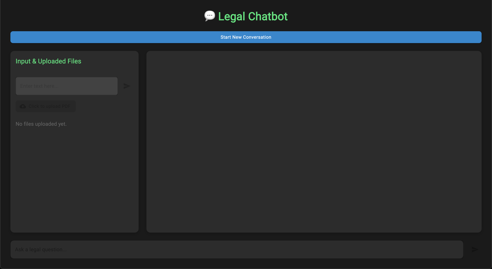
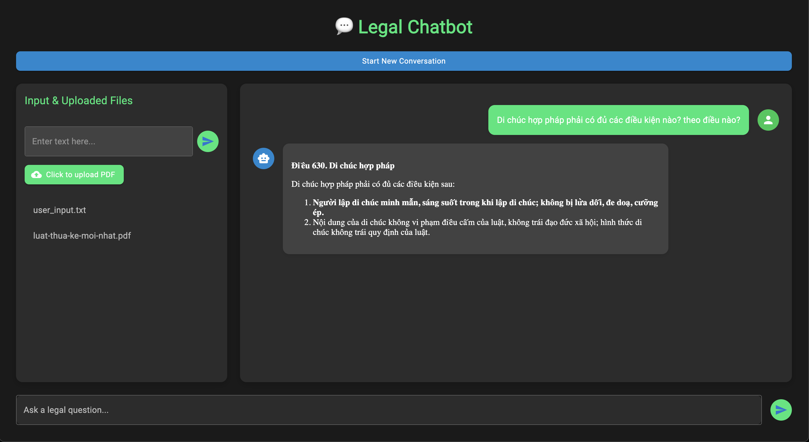
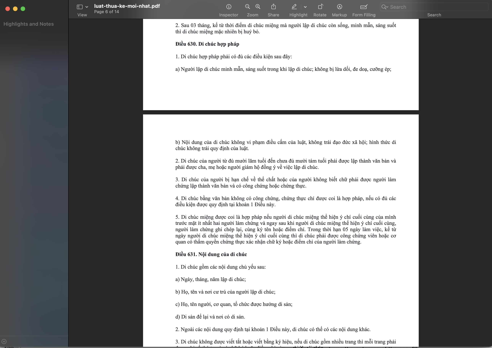

# Legal RAG Chatbot

   

A Retrieval-Augmented Generation (RAG) system designed for legal research, integrating Milvus as a vector database, Voyage AI for legal embeddings, and Ollama for local LLM inference. This project includes a React frontend and a FastAPI backend, enabling users to upload legal documents (PDFs) or text, and query legal information efficiently.

---

## Table of Contents
- [Features](#features)
- [Tech Stack](#tech-stack)
- [Installation](#installation)
  - [Prerequisites](#prerequisites)
  - [Backend Setup](#backend-setup)
  - [Frontend Setup](#frontend-setup)
- [Usage](#usage)
- [Project Structure](#project-structure)
- [How It Works](#how-it-works)
- [Expectations & Deliverables](#expectations--deliverables)
- [Contributing](#contributing)
- [License](#license)
- [Acknowledgments](#acknowledgments)

---

## Features
- **Upload Legal Documents:** Supports uploading PDF files and raw text for indexing.
- **Legal-Specific Embeddings:** Uses Voyage AI's `voyage-law-2` model optimized for legal contexts.
- **Vector Storage:** Stores embeddings in Milvus Lite for efficient retrieval.
- **Conversational Interface:** Chatbot powered by Llama 3.2:3b (via Ollama) to answer legal queries based on uploaded data.
- **Multi-Conversation Support:** Each conversation has its own isolated collection in Milvus.

---

## Tech Stack
- **Backend:**
  - [FastAPI](https://fastapi.tiangolo.com/): High-performance web framework for building APIs.
  - [Milvus Lite](https://milvus.io/): Lightweight vector database for storing embeddings.
  - [Voyage AI](https://voyageai.com/): Provides legal-specific embeddings.
  - [Ollama](https://ollama.ai/): Local LLM inference with Llama 3.2:3b.
  - [PyPDF](https://pypdf.readthedocs.io/): PDF text extraction.

- **Frontend:**
  - [React](https://reactjs.org/): JavaScript library for building user interfaces.
  - [Material-UI](https://mui.com/): React component library for styling.
  - [axios](https://axios-http.com/): HTTP client for API requests.
  - [react-dropzone](https://react-dropzone.js.org/): File upload handling.

---

## Installation

### Prerequisites
- **Python 3.9+**: For the backend.
- **Node.js 16+**: For the frontend.
- **Ollama**: Install and run locally with Llama 3.2:3b model (`ollama pull llama3.2:3b`).
- **Voyage AI API Key**: Sign up at [Voyage AI](https://voyageai.com/) and get your API key.

### Clone the repository

```bash
git clone https://github.com/HCNT-cre/danaexperts-test.git
cd danaexperts-test
```

### Backend Setup

Set up the backend environment:

```bash
cd backend
python3 -m venv venv
source ./venv/bin/activate
pip install -r requirements.txt
```

Create a `.env` file and add your Voyage API key:

```bash
echo "VOYAGE_API_KEY=your_api_key_here" > .env
```

Run the backend:

```bash
uvicorn main:app --reload
```

The backend API will now run at `http://127.0.0.1:8000`.

### Frontend Setup

Set up and start the frontend application:

```bash
cd ../frontend
yarn install
yarn dev
```

Open your browser and navigate to `http://localhost:5173`.

---

## How It Works

This Legal RAG Chatbot leverages Retrieval-Augmented Generation (RAG) to provide accurate legal responses based on uploaded documents or text. Below is a detailed breakdown of its operational flow:

1. **Document Upload and Processing:**
   - **PDF Handling:** When users upload PDF files via the frontend, the backend uses the `PyPDF` library to parse and extract text from each page. Only pages with extractable text are processed, ensuring no empty or unreadable content is included.
   - **Text Input:** Users can also directly input raw legal text through a dedicated text field. This text is treated as a single document segment, bypassing the need for PDF parsing.

2. **Embedding Generation:**
   - **Text Segmentation:** For PDFs, extracted text is segmented by page. Each page or raw text input becomes an individual unit for embedding.
   - **Voyage AI Embedding:** The system employs Voyage AI's `voyage-law-2` model, specifically optimized for legal contexts, to convert these text segments into high-dimensional vector embeddings (1024 dimensions). These embeddings capture the semantic meaning of the text, enabling efficient similarity-based retrieval.

3. **Storage and Indexing:**
   - **Milvus Lite Integration:** The generated embeddings, along with their corresponding text, are stored in Milvus Lite, a lightweight vector database. Each conversation has its own isolated collection (e.g., `legal_rag_collection_<conversation_id>`), ensuring data separation between sessions.
   - **Indexing Process:** Milvus indexes the embeddings using the Inner Product (IP) metric for similarity search, with a strong consistency level to guarantee accurate retrieval. Each entry includes an `id`, the `vector` embedding, and the original `text` stored in a dynamic JSON field.

4. **Query Processing and Retrieval:**
   - **User Query Embedding:** When a user submits a legal question, the query is embedded using the same `voyage-law-2` model, producing a vector representation of the question.
   - **Vector Search:** The system performs a similarity search in the Milvus collection associated with the current conversation, retrieving the top 4 most relevant text segments based on their vector proximity to the query.
   - **Reranking:** Retrieved segments are reranked using a custom similarity scoring function (dot product of embeddings), narrowing them down to the top 2 most relevant pieces of context to ensure precision.

5. **Response Generation:**
   - **Context Assembly:** The top 2 retrieved text segments are combined into a single context string, separated by double newlines, to provide a coherent input for the language model.
   - **Ollama and Llama 3.2:3b:** The system uses Ollama to run the Llama 3.2:3b model locally (via `http://localhost:11434/v1`). This model processes the context and query under a strict system prompt, ensuring responses are concise, accurate, and limited to the provided context.
   - **Markdown Formatting:** Responses are formatted in Markdown, with bolded legal terms (e.g., **Điều 630**) and structured lists (numbered or bulleted) for clarity and readability.

6. **Error Handling and Feedback:**
   - If no relevant context is found or an error occurs (e.g., Milvus collection missing, LLM failure), the system returns a clear error message or a suggestion to refine the query, ensuring a robust user experience.

This pipeline combines efficient document processing, advanced embeddings, vector storage, and local LLM inference to deliver a powerful tool for legal research, all while maintaining data isolation per conversation.

---

## Usage

This section provides a step-by-step guide to using the Legal RAG Chatbot effectively. Follow these instructions to upload legal data and query the system. Screenshots are included to illustrate key steps.

### 1. Start a New Conversation
- **Action:** Open the application in your browser (default: `http://localhost:5173`) and click the **"Start New Conversation"** button located near the top of the interface.
- **Result:** A unique conversation ID is generated, creating a new isolated collection in Milvus to store your data. A success message will appear via a snackbar (e.g., "New conversation started with ID: <conversation_id>").
- **Screenshot:**
  
  *Caption: Clicking "Start New Conversation" initiates a new session.*

### 2. Upload Data
The chatbot supports two types of data input: PDF documents and raw text. Both are processed and indexed for querying.

#### a. Uploading PDF Files
- **Action:** In the left panel, click the **"Click to upload PDF"** button. A file picker will open—select one or more legal PDF files (e.g., court judgments, contracts).
- **Process:** The system extracts text from each page of the PDFs using PyPDF, embeds it with Voyage AI, and stores it in Milvus.
- **Feedback:** Upon successful upload, a snackbar confirms: "PDF upload successful!" The uploaded file names appear in the "Uploaded Files" list.

#### b. Uploading Raw Text
- **Action:** In the left panel’s text field labeled "Enter text here...", type or paste legal text (e.g., a statute or case summary). Press the **Send** button (or hit `Enter`).
- **Process:** The text is embedded directly and stored in Milvus without additional parsing.
- **Feedback:** A snackbar confirms: "Text upload successful!" The list updates with "user_input.txt" as a placeholder name.

### 3. Ask Questions
- **Action:** In the bottom text field labeled "Ask a legal question...", type a question related to your uploaded data (e.g., "What are the key points of this judgment?"). Press the **Send** button (or hit `Enter`).
- **Process:** 
  - The query is embedded and used to retrieve relevant context from Milvus.
  - The Llama 3.2:3b model generates a response based on this context, formatted in Markdown for readability.
- **Result:** The chatbot displays the answer in the chat area, with user questions on the right and AI responses on the left.
- **Screenshots:**
  - 
    *Caption: Asking a question and receiving a response in the chat interface.*
  - 
    *Caption: Check answer with raw pdf.*
### Tips for Best Results
- **Specific Questions:** Ask precise questions (e.g., "Who were the lawyers in the case?") to get focused answers.
- **Upload Relevant Data:** Ensure the uploaded PDFs or text contain the information you intend to query.
- **Check Uploads:** Verify the "Uploaded Files" list to confirm all data has been indexed before querying.

### Example Workflow
1. Start a conversation.
2. Upload a PDF of a court judgment.
3. Ask: "What was the outcome of the case?"
4. Review the AI’s response in the chat.

With these steps, you can efficiently explore legal documents and extract insights using the chatbot!

---

## License

Distributed under the MIT License. See `LICENSE` for more information.

---

## Acknowledgments

- [Voyage AI](https://voyageai.com/) for specialized legal embeddings
- [Ollama](https://ollama.ai/) for local LLM inference
- [Milvus](https://milvus.io/) for efficient vector search capabilities

